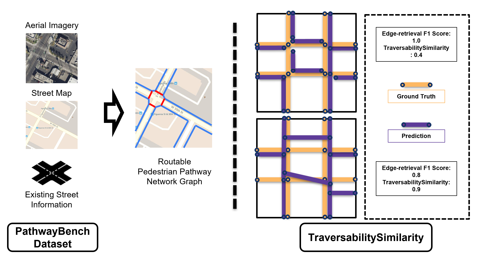

# PathwayBench: A Benchmark for Extracting Routable Pedestrian Path Network Graphs

<p align="center"></p>


## Abstract
Applications to support pedestrian mobility in urban areas require an accurate, complete, and routable graph representation of the built environment. Globally available information, including aerial imagery provides a scalable, low-cost source for constructing these path networks, but the associated learning problem is challenging: Relative to road network pathways, pedestrian network pathways are narrower, more frequently disconnected, often visually and materially variable in smaller areas (as opposed to roads' consistency in a region or state), and their boundaries are broken up by driveway incursions, alleyways, marked or unmarked crossings through roadways.  Existing algorithms to extract pedestrian pathway network graphs are inconsistently evaluated and tend to ignore routability, making it difficult to assess utility for mobility applications: Even if all path segments are available, discontinuities could dramatically and arbitrarily shift the overall path taken by a pedestrian. In this paper, we describe a first standard benchmark for the pedestrian pathway network graph extraction problem, comprising the largest available dataset equipped with manually vetted ground truth annotations (covering $3,000 km^2$ land area in regions from 8 cities), and a family of evaluation metrics centering routability and downstream utility.  By partitioning the data into polygons at the scale of individual intersections, we can compute local routability as an efficient proxy for global routability.  We consider multiple measures of polygon-level routability, including connectivity, degree centrality, and betweenness centrality, and compare predicted measures with ground truth to construct evaluation metrics. Using these metrics, we show that this benchmark can surface strengths and weaknesses of existing methods that are hidden by simple edge-counting metrics over single-region datasets used in prior work, representing a challenging, high-impact problem in computer vision and machine learning.


## Installation

```shell
# create and activate the conda environment
conda create -n pathwaybench python=3.8
conda activate pathwaybench

# install the necessary packages with `requirements.txt`:
pip install -r requirements.txt
```
This code has been tested with Python 3.8 on Ubuntu 18.04. 

